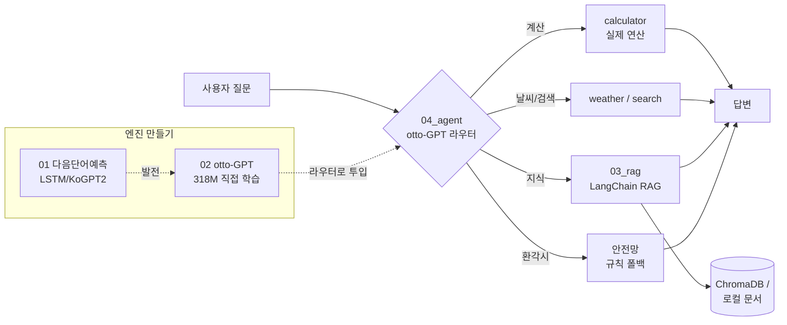

# 🤖 개인프로젝트 — 나만의 모델부터 에이전트까지

> **"챗봇은 차체(서비스), 모델은 엔진."**
> 다음 단어를 예측하는 작은 모델에서 출발해 → 처음부터 만든 한국어 LLM → RAG → **자율 에이전트**까지,
> 엔진을 직접 만들고 키워서 하나의 시스템으로 완성한 프로젝트.

   

---

## 🗺️ 한눈에 보는 전체 구조



| 단계 | 폴더 | 한 줄 설명 | 버전 |
|:--:|---|---|:--:|
| 🧩 **모델** | [`01_next_word_model/`](01_next_word_model) | 다음 단어 예측 → autoregressive 문장 생성 챗봇 (FastAPI) | `v2` |
| 🧠 **LLM** | [`02_otto_gpt/`](02_otto_gpt) | 토크나이저·아키텍처·가중치 전부 직접 만든 **318M** GPT | `v6` |
| 📚 **RAG** | [`03_rag/`](03_rag) | LangChain LCEL RAG + FastAPI + LangSmith + RAGAS | `v5` |
| 🤖 **에이전트** | [`04_agent/`](04_agent) | otto가 도구를 골라 실행, 환각 안전망 (FastAPI) | `v8` |
| 🚀 **배포** | [`deployment/`](deployment) | HuggingFace Space (Gradio) | — |

> Python **3.14 고정** (`.python-version`) · 가상환경 `uv` · 버전 이력은 모듈별 `CHANGELOG.md` + [`VERSIONING.md`](VERSIONING.md)

---

## 📁 폴더 구조

```
개인프로젝트/
│
├── 01_next_word_model/        🧩 나만의 모델 (5주차)
│   ├── chatbot_model.py          LSTM 다음단어 예측 (직접 학습)
│   ├── kogpt2_chatbot.py         KoGPT2 기반 (FastAPI 앱이 사용)
│   ├── train.py                  LSTM 학습 스크립트
│   ├── app.py                    FastAPI 서버 (/chat, /next-word)
│   ├── static/ · data/ · artifacts/
│   └── CHANGELOG.md
│
├── 02_otto_gpt/               🧠 나만의 LLM (from scratch, 318M)
│   ├── otto_gpt_scratch.ipynb       토크나이저 → 사전학습 (Colab GPU)
│   ├── finetune_instruct_colab.ipynb  멀티태스크 instruction 튜닝
│   └── CHANGELOG.md
│
├── 03_rag/                    📚 RAG
│   ├── langchain_rag/            ⭐ 최종본 (LangChain 마이그레이션)
│   │   ├── app/
│   │   │   ├── rag_chain.py         LCEL 체인 + 멀티턴(대화기록·트리밍)
│   │   │   ├── api.py               FastAPI (/query /chat /search /reindex)
│   │   │   ├── ingest.py            문서→청킹→임베딩→Chroma
│   │   │   └── config.py            설정 + LangSmith Tracing
│   │   ├── evaluation/
│   │   │   ├── eval_langsmith.py    LangSmith Dataset 평가
│   │   │   ├── eval_ragas.py        RAGAS 4지표 평가
│   │   │   └── dataset.jsonl        평가셋 11문항
│   │   ├── docs/ · cli.py · requirements.txt
│   │   └── CHANGELOG.md
│   └── legacy/                   마이그레이션 前 원본 (rag, rag_chroma)
│
├── 04_agent/                  🤖 에이전트 (시스템 종착점)
│   ├── agent.py                 실행 루프 (라우팅→인자보정→도구→답변)
│   ├── parser.py                도구호출 문자열 파싱
│   ├── tools.py                 도구 레지스트리 (calculator/weather/search/rag)
│   ├── extract.py               원문에서 정밀 인자 재추출 (모델 약점 보완)
│   ├── local_rag.py             오프라인 문서 검색 (TF-IDF, quota 0)
│   ├── local_router.py          otto 없을 때 규칙 라우터
│   ├── hybrid.py                환각 차단 안전 라우터
│   ├── model.py · otto_model.py otto-GPT 추론 래퍼 (318M 자동 선택)
│   ├── api.py                   FastAPI (POST /agent)
│   ├── demo_offline.py          완전 오프라인 데모
│   ├── colab_agent_demo.ipynb   Colab에서 진짜 318M + Gradio UI
│   └── CHANGELOG.md
│
├── deployment/                🚀 HuggingFace Space
├── README.md · VERSIONING.md · .python-version
```

---

## 🧩 01_next_word_model — 나만의 모델

문장을 넣으면 **다음 단어를 예측**하고, 그걸 autoregressive 하게 반복해 문장을 완성한다. FastAPI로 웹 제공.

```bash
cd 01_next_word_model
uv venv && source .venv/bin/activate
uv pip install -r requirements.txt
uvicorn app:app --reload          # POST /chat, GET /next-word
```

## 🧠 02_otto_gpt — 나만의 LLM (318M, 처음부터)

토크나이저(SentencePiece BPE 16K)·아키텍처(Decoder-only Transformer)·가중치를 **전부 직접** 만든다.
57M으로 시작 → **"파라미터=지식 용량"을 직접 증명**(ppl 31→4.4)하며 **318M**으로 스케일업.

| 노트북 | 역할 | 산출물 (구글 드라이브) |
|---|---|---|
| `otto_gpt_scratch.ipynb` | 토크나이저 → 사전학습 (한국어 위키 + 교과서) | `otto_gpt_350m.pt` |
| `finetune_instruct_colab.ipynb` | 멀티태스크 instruction 튜닝 (대화 + 도구호출) | `otto_gpt_350m_instruct.pt` |

> 학습은 Colab GPU(A100 권장). 가중치(~4GB)는 드라이브에 저장 — 이 폴더엔 **만드는 노트북**이 있다.

## 📚 03_rag — LangChain RAG

```bash
cd 03_rag/langchain_rag
uv venv && source .venv/bin/activate
uv pip install -r requirements.txt
cp .env.example .env              # GOOGLE_API_KEY, LANGSMITH_API_KEY
python -m app.ingest              # 인덱스 구축
uvicorn app.api:app --reload      # REST API
python -m evaluation.eval_langsmith --langsmith   # LangSmith 평가
```

## 🤖 04_agent — 에이전트

otto-GPT가 **라우터**(어떤 도구를 쓸지 결정), 에이전트가 **파싱 → 인자 재추출 → 도구 실행 → 답변**.
**핵심 설계**: 모델의 자유 생성 텍스트를 답으로 쓰지 않음 → 환각이 사용자에게 도달 0.

```bash
cd 04_agent
uv venv && uv pip install fastapi "uvicorn[standard]"
uvicorn api:app --port 8001       # POST /agent
python demo_offline.py            # Gemini/Colab 없이 완전 오프라인 데모
```

---

## ✅ 과제 요구사항 충족

**[5주차] 챗봇**
- [x] 사용자 문장 → 다음 단어 생성 모델 · [x] autoregressive 문장 생성 · [x] FastAPI 래핑

**[7주차] RAG**
- [x] 개인 RAG 파이프라인 → **LangChain 마이그레이션** (`legacy/` 에 前 원본 보존)
- [x] LangChain RAG **FastAPI REST API** 배포
- [x] **LangSmith Tracing + Dataset 평가** (+ RAGAS 4지표 보너스)

**[심화] 나만의 모델/에이전트**
- [x] from-scratch 한국어 LLM(otto-GPT 318M) · [x] 도구 사용 에이전트 · [x] 환각 안전망

---

## 🔑 핵심 인사이트

- **파라미터 = 천장**: "시간 더 학습"이 아니라 모델 크기가 지식 용량을 정한다. 57M(ppl 31)→318M(ppl 4.4)로 증명.
- **작은 모델 = 라우터**: 57M/318M은 지식 모델이 아니라 *도구 라우터*로 쓰고, 지식은 RAG에 외주.
- **시스템이 모델을 메운다**: 숫자 복사 실패·환각을 에이전트 레이어(인자 재추출 + 안전 라우터 + 로컬 RAG)가 흡수.
