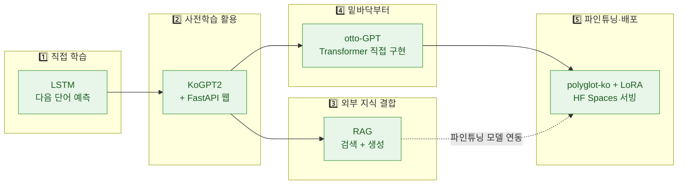
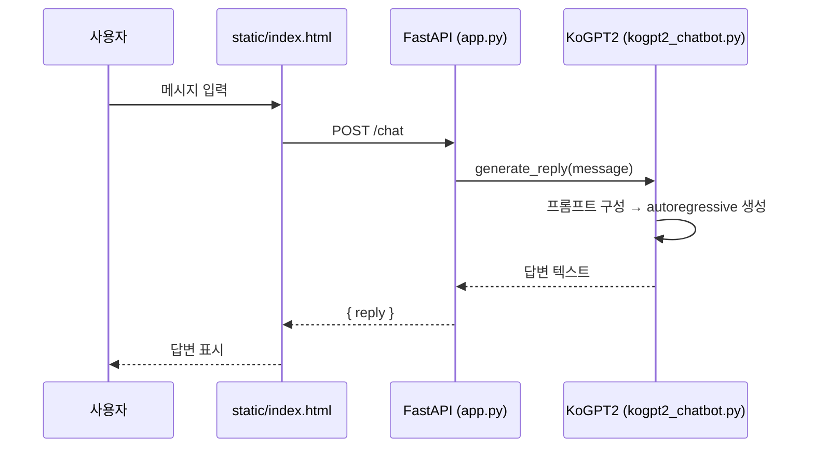

# 한국어 챗봇 만들기

> 가장 단순한 **다음 단어 예측(LSTM)** 부터, **사전학습 모델 활용**, **RAG**,
> **GPT 밑바닥부터 구현**, **대형 모델 파인튜닝·배포** 까지 —
> 한국어 챗봇을 만드는 방법을 난이도 순으로 직접 구현한 학습용 레포지토리입니다.

각 단계는 **독립적으로 실행 가능한 폴더**로 분리되어 있으며, 번호는 학습/구현 순서를 의미합니다.

---

## 🧭 전체 구조 한눈에 보기

5개의 단계는 "지식을 어디에 담는가"와 "모델을 누가 만드는가" 기준으로 점점 발전합니다.



| 단계 | 폴더 | 접근법 | 핵심 기술 | 모델 출처 |
|---|---|---|---|---|
| 1 | [`1_lstm_next_word/`](1_lstm_next_word) | 다음 단어 예측 후 autoregressive 생성 | TensorFlow / Keras LSTM | **직접 학습** |
| 2 | [`2_kogpt2_web/`](2_kogpt2_web) | 사전학습 GPT로 답변 생성 + 웹 UI | KoGPT2, FastAPI | 사전학습 |
| 3 | [`3_rag/`](3_rag) | 외부 문서를 검색해 근거 기반 답변 | 임베딩, ChromaDB, pandas | 사전학습 + 검색 |
| 4 | [`4_otto_gpt_scratch/`](4_otto_gpt_scratch) | 토크나이저·아키텍처·가중치 전부 직접 | Decoder-only Transformer (~57M) | **직접 구현** |
| 5 | [`5_finetune_deploy/`](5_finetune_deploy) | 대형 한국어 모델 LoRA 파인튜닝 후 배포 | polyglot-ko 1.3B/5.8B, LoRA, Gradio | **직접 파인튜닝** |

---

## 📂 폴더 구조

```
한국어 챗봇/
│
├── 1_lstm_next_word/          # ① 다음 단어 예측 (직접 학습)
│   ├── chatbot_model.py       #    LSTM 모델 정의 · 토크나이저 · 문장 생성
│   ├── train.py               #    corpus 학습 → artifacts/ 저장
│   ├── data/corpus.txt        #    학습 코퍼스
│   └── artifacts/             #    학습된 모델 · 토크나이저 · 메타
│
├── 2_kogpt2_web/              # ② 사전학습 KoGPT2 + 웹 챗봇
│   ├── kogpt2_chatbot.py      #    KoGPT2 로딩 · 답변 생성
│   ├── app.py                 #    FastAPI 서버 (/chat, /next-word)
│   └── static/index.html      #    채팅 UI
│
├── 3_rag/                     # ③ RAG (검색 증강 생성)
│   ├── basic/                 #    임베딩 벡터검색 + pandas 표 계산
│   ├── chroma/                #    ChromaDB 기반 RAG + 파인튜닝 연동
│   └── langchain/             #    LangChain 버전 (작업 예정)
│
├── 4_otto_gpt_scratch/        # ④ GPT 밑바닥부터 구현 (Colab)
│   ├── otto_gpt_scratch.ipynb #    토크나이저 학습 → 사전학습
│   └── finetune_instruct_colab.ipynb  # instruction 튜닝
│
├── 5_finetune_deploy/         # ⑤ 파인튜닝 모델 배포 (HuggingFace Spaces)
│   ├── hf_space_1.3b/         #    polyglot-ko-1.3b + LoRA (Gradio)
│   └── hf_space_5.8b/         #    polyglot-ko-5.8b + LoRA (Gradio, GPU)
│
├── requirements.txt           # 1·2단계 공통 의존성
└── README.md
```

> 각 폴더에는 **자체 README** 가 있어 해당 단계의 상세 설명·실행법을 담고 있습니다.

---

## ⚙️ 동작 흐름 (2단계 웹 챗봇 예시)



---

## 🚀 빠른 시작

가장 대표적인 **2단계 KoGPT2 웹 챗봇** 실행 예시입니다.

```bash
pip install -r requirements.txt

# (선택) 1단계 LSTM 모델을 직접 학습하려면
cd 1_lstm_next_word && python3 train.py && cd ..

# 2단계 웹 챗봇 실행
cd 2_kogpt2_web
python3 -m uvicorn app:app --reload   # → http://127.0.0.1:8000
```

| 단계 | 실행 위치 | 명령 |
|---|---|---|
| 1 LSTM 학습 | `1_lstm_next_word/` | `python3 train.py` |
| 2 웹 챗봇 | `2_kogpt2_web/` | `uvicorn app:app --reload` |
| 3 RAG | `3_rag/basic` · `3_rag/chroma` | 각 폴더 README 참고 |
| 4 from-scratch | `4_otto_gpt_scratch/` | Colab에서 노트북 실행 |
| 5 배포 | `5_finetune_deploy/` | HuggingFace Spaces 업로드 |

---

## 🌐 2단계 API

| 메서드 | 경로 | 설명 |
|---|---|---|
| `POST` | `/chat` | `{"message": "..."}` → 답변 |
| `GET` | `/next-word?text=...` | 다음 단어 1개 예측 |

---

## 📌 참고
- `requirements.txt` 는 1·2단계용입니다. 3·4·5단계는 각 폴더 README의 의존성을 따로 설치하세요.
- API 키(`.env`) 와 재생성 가능한 인덱스·체크포인트는 커밋에서 제외됩니다(`.gitignore`).
